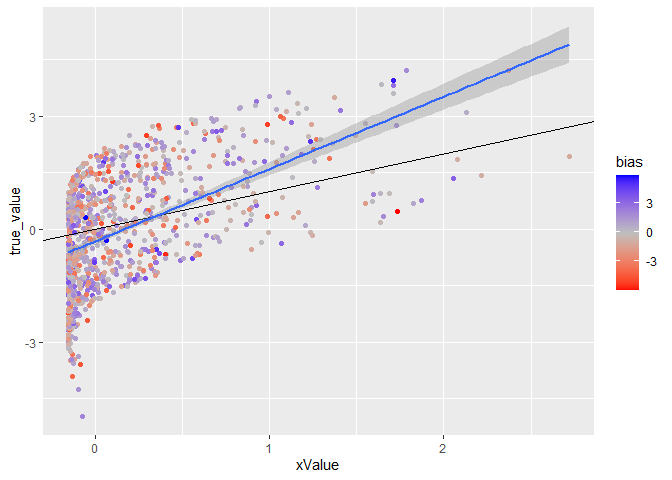
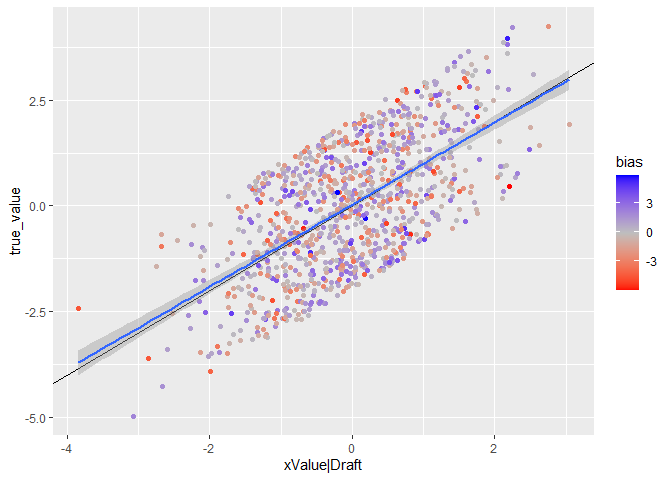
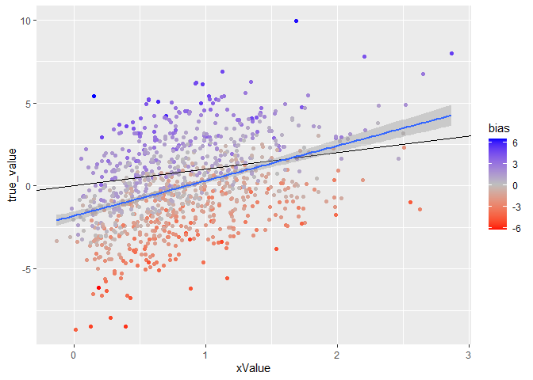

Simulation Writeup
================
CJ Turtoro
1/9/2021

# Simulating Draft Valuations

The premise here is that we want to be able to estimate the value of a
prospect heading into a draft. Presumably, in order to empirically
evaluate a prospect, we will need to build a model that bases the value
of a prospect off the historical performance of similar players.

Sounds easy enough.

We encounter a fairly severe issue, though, in determining this value.
The big problem is that we can only measure the performance of players
that made the NHL. Therefore, if there is some trait you possess that
puts players at a disadvantage normally, then players like you will
typically not get into the league. But the ones that did, likely did so
because they were exceptional. And so, building a model that includes
only those exceptional players could mistakenly belive that this
disadvantage is actually good.

Confused? Okay, let’s try an example. Let’s say I want to build a model
on how certain pitching prospects will perform in the MLB, and there’s a
prospect that only has one hand. The model sees that there has only been
one such pitcher in MLB history – former Cy Young finalist, Jim Abbott.
So, when the model is trying to determine the value of being one-handed,
it sees the only such historical example to do so was fairly good, and
therefore it would likely reward the attribute.

The model can only measure what is there to be measured. Most
individuals with one hand do not become MLB pitchers. It seems unlikely
that being one-handed does not give you an advantage over a similarly
productive two-handed pitcher. But, since the model’s only precedent for
such a player is good, it thinks the attribute is valuable.

Now, overestimation of the differently-limbed population is not likely
to be a particularly common issue with your projection model. There are
probably not too many of those prospects, and if there were, I’d
question your modeling acumen if you were to include “number of arms” as
a predictor. But what if some other characteristic that were more common
and more likely to matter suffered from the same selection bias?

As misfortune would have it, hockey has a fairly well-documented history
of just this phenomenon on another immutable physical characteristic –
height. NHL teams have been undervaluing short players for a long time.
Being short makes you less likely to make it into the NHL and so the
ones that do are normally a fair amount better than taller players that
had produced at a comparable level as a prospect. Why? In order to make
it into the NHL, the short player needed to make it over not only the
initial threshold of “good enough to be an NHLer”, but also an
additional threshold of “good enough to overcome his small stature”.

So how can we build a model to handle this bias?

That will be what this piece investigates. But we won’t be able to model
it with data we don’t have, so we’ll have to create some fake data to
work with.

## Buliding the Simulation

In our dataset, we want to build 1000 players that have some variable of
talent that we’ll call “skill” and assume is normally distributed. We
also want them to possess some attribute that will force prejudice from
the selectors (NHL teams) which we’ll call “bias” and allow to be
normally distributed as well. Finally, things don’t always go as you
expect, so we’ll also include a uniformly distributed value of
randomness.

``` r
library(tidyverse)
```

    ## -- Attaching packages -------------------------------- tidyverse 1.3.0 --

    ## v ggplot2 3.3.0     v purrr   0.3.4
    ## v tibble  3.0.1     v dplyr   0.8.5
    ## v tidyr   1.0.3     v stringr 1.4.0
    ## v readr   1.3.1     v forcats 0.5.0

    ## -- Conflicts ----------------------------------- tidyverse_conflicts() --
    ## x dplyr::filter() masks stats::filter()
    ## x dplyr::lag()    masks stats::lag()

``` r
library(modelr)
library(ggplot2)

prospects <- data.frame(
  name = paste0("Player",1:1000),
  skill = rnorm(1000,0,1),
  bias = rnorm(1000,0,2),
  randomness = runif(1000,-2,2)
) %>%
  mutate(makes_nhl = ifelse(bias + skill>1,1,0),
         true_value = skill + randomness)
```

## Modeling the simulation

I’m going to approach the model-building from two standpoints, but with
the same ultimate goal – predicting the “true value” of an NHL prospect,
independent of the selection bias imparted by NHL teams. I think it
would be helpful to calculate two things that are able to be modeled
independently; the probability of a prospect making the NHL, and the
projected value of the prospect. Let’s call making the NHL \(A\) and
let’s say that their projected value is \(B\). This arms us with the
following tools:

  - \(P(A)\) will be the probability of getting into the league.
  - \(E(B|A)\) the projected value of the player IF they make it.

Note that this is all we can model directly. We cannot estimate \(B\),
because players that are not good enough won’t end up being measured.
However, we can caluculate what value we expect to observe from the
player using conditional expectation: \(E(B) = E(B|A)*P(A)\). Remember
though, that this is not the “true value” that we are aiming to find,
just the value we expect to be realized.

Armed with these two models, let’s see what types of results we can
produce.

As one would expect, the issue with the conditional expectation formula
is that all the bad players “collapse” around 0 – thus overestimating
the value of players that were really negative in value. However it also
*underestimates* the players that actually do make it as an annoying
sort of compensation.

So maybe we’ll have more like with the part where we just build the
model off the players that did make it.

``` r
ggplot(results,aes(x=xValue,y=true_value,
                   color = bias)) +
  geom_point()+
  scale_color_gradientn(colours = c("red","grey","blue")) +
  geom_abline(slope = 1,intercept = 0) +
  geom_smooth(method="lm")
```

    ## `geom_smooth()` using formula 'y ~ x'

<!-- -->

``` r
ggplot(results,aes(x=`xValue|Draft`,y=true_value,
                   color = bias)) +
  geom_point() +
  scale_color_gradientn(colours = c("red","grey","blue")) +
  geom_abline(slope = 1,intercept = 0)+
  geom_smooth(method="lm")
```

    ## `geom_smooth()` using formula 'y ~ x'

<!-- -->

Huzzah\! That looks amazing. The bias is scattered all over, we have a
straight line going right down the damn center of the graph and the only
error comes from the uniform random variation we programmed in. Problem
solved, right\!

Eh, not so fast. An issue with our simulation here is that it assumes
the bias is independent of true value. This is not likely to be the case
– height probably does hold *some* predictive value when determining if
a player will be successful. In the extreme, I’d imagine a 3’0" players
would likely not be particularly effective. It’s not that the attribute
containing the bias is *irrelevent* it’s just that it’s impact is
*exaggerated*. So lets see what happens to our graphs if we tweak the
calculations so that rather than being with 0, the “bias” variable is
simply truly worth 1/2 of what NHL teams think. So “bias” will count
twice towards the probability of making the NHL, but only once towards
calculating their true value.

    ## `geom_smooth()` using formula 'y ~ x'

<!-- -->

    ## `geom_smooth()` using formula 'y ~ x'

<!-- -->
